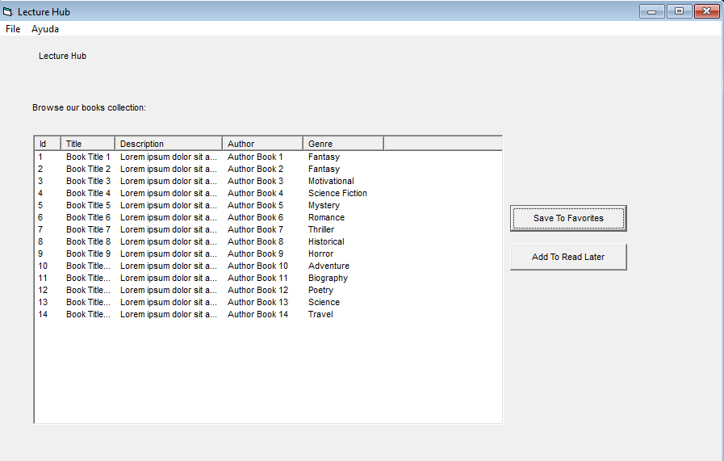
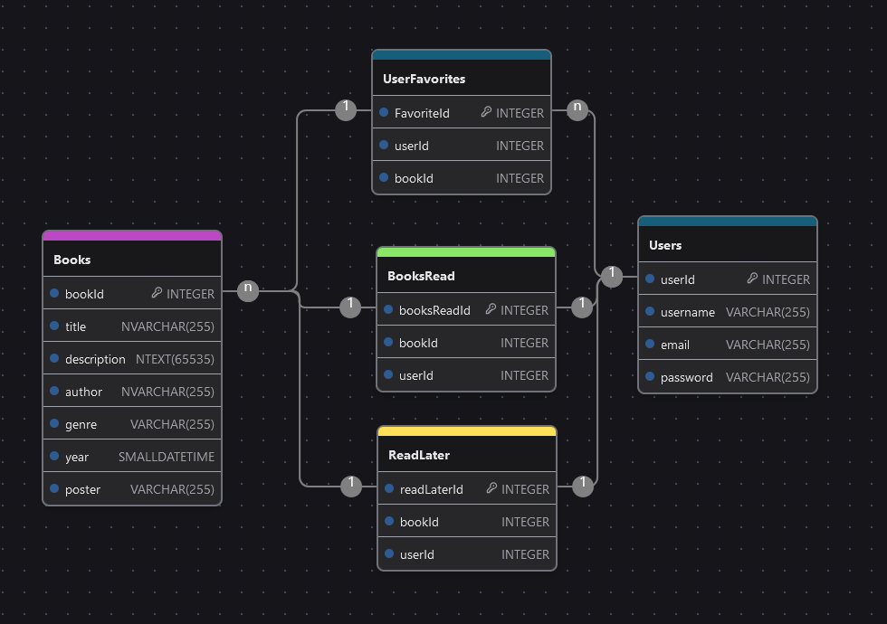

# lecturehub

New implementation & client requirements changed; it is now required to create a program to keep track of Books. 

## Client Program

Implementing `Visual Basic 6.0`

## Database

Implementing `Microsoft SQL Server 2022`.

### E-R Diagram

### Feedback

| ¿Qué salió bien? | ¿Qué puedo hacer diferente? | ¿Qué no salió bien?
| ------ | ----------- | ----------- |
| - Database Connection | - User Interface | - Deliver on time
| - MS SQL Database Creation  | - Time management | - Time management
| - Displaying Books selection | - Tables normalization | - Add Functionalities (Remove, etc)